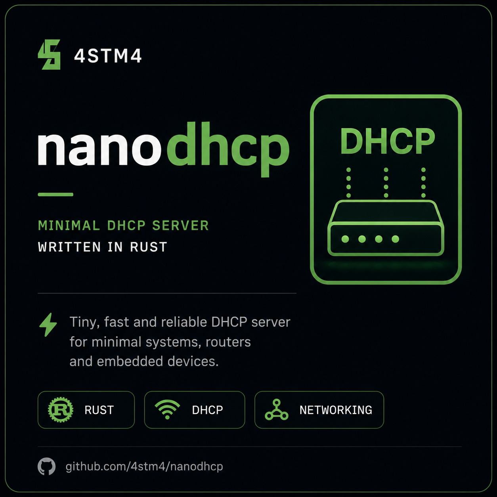
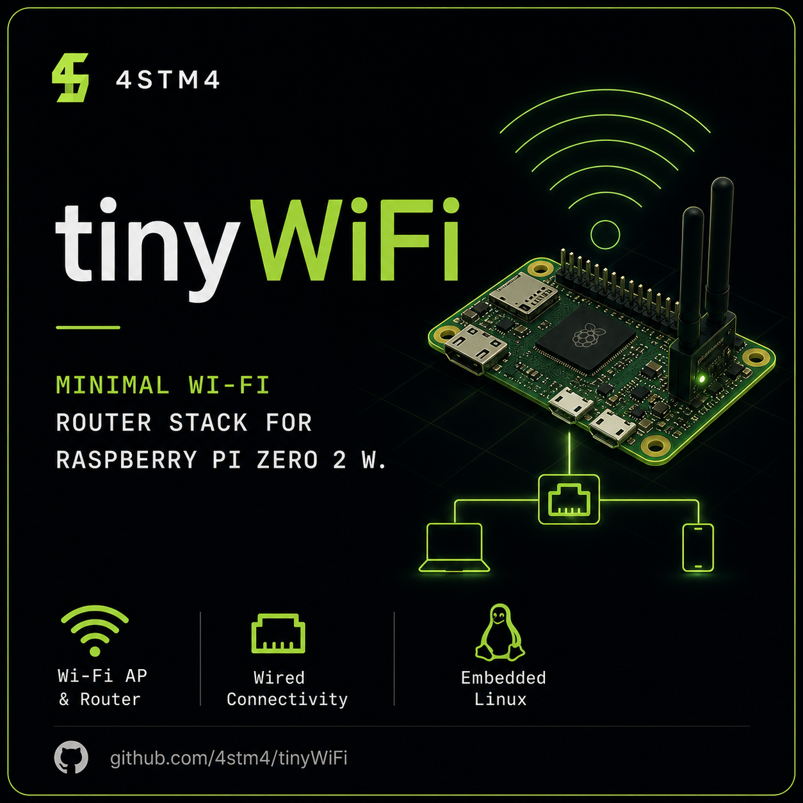
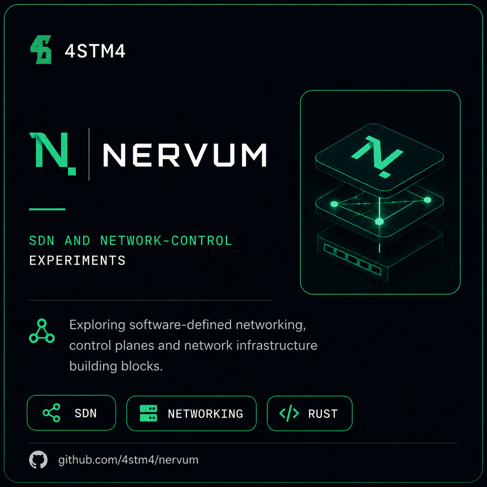
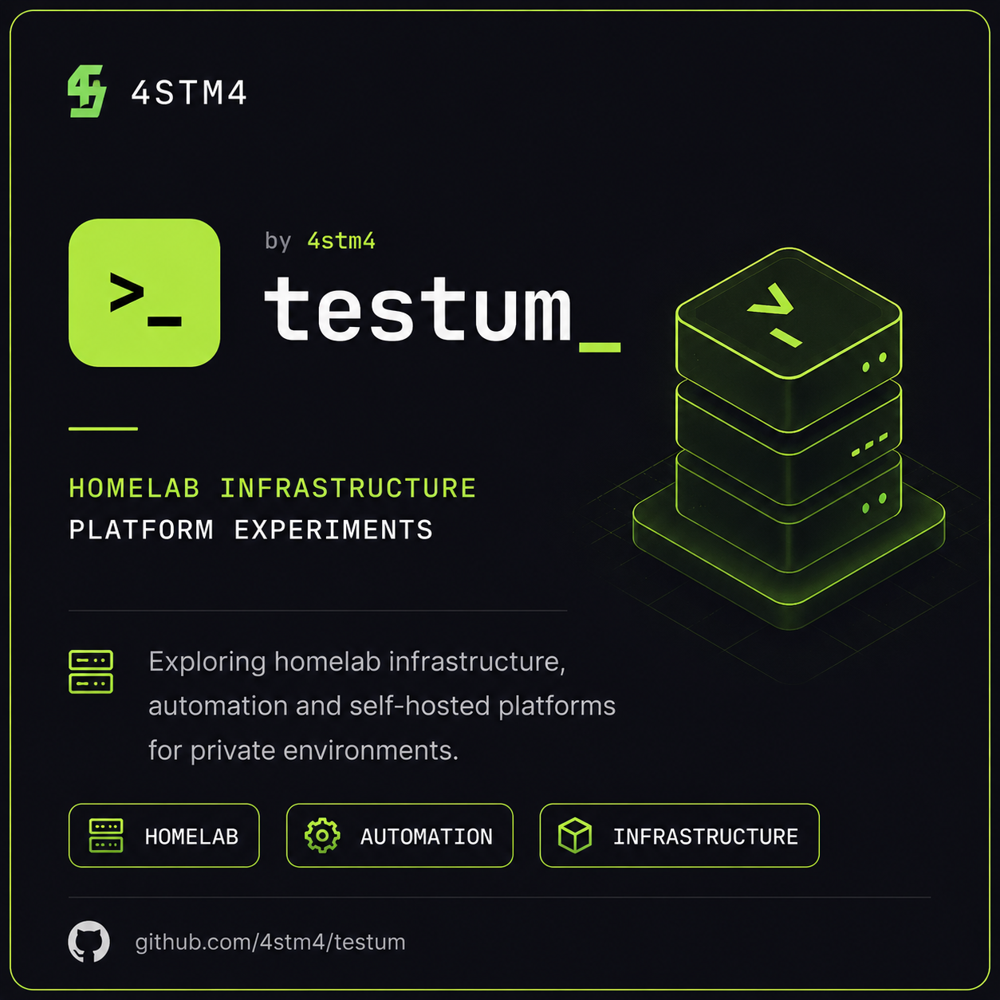
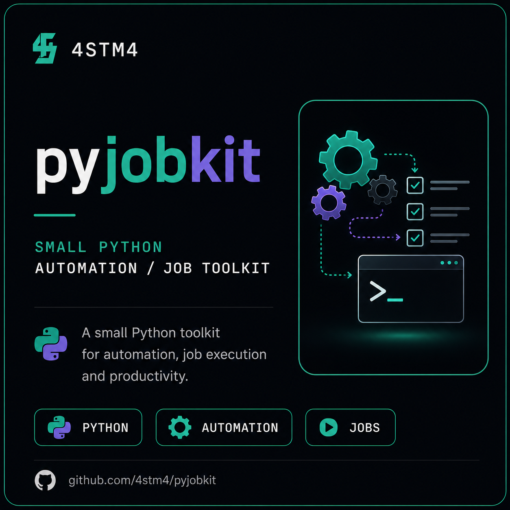
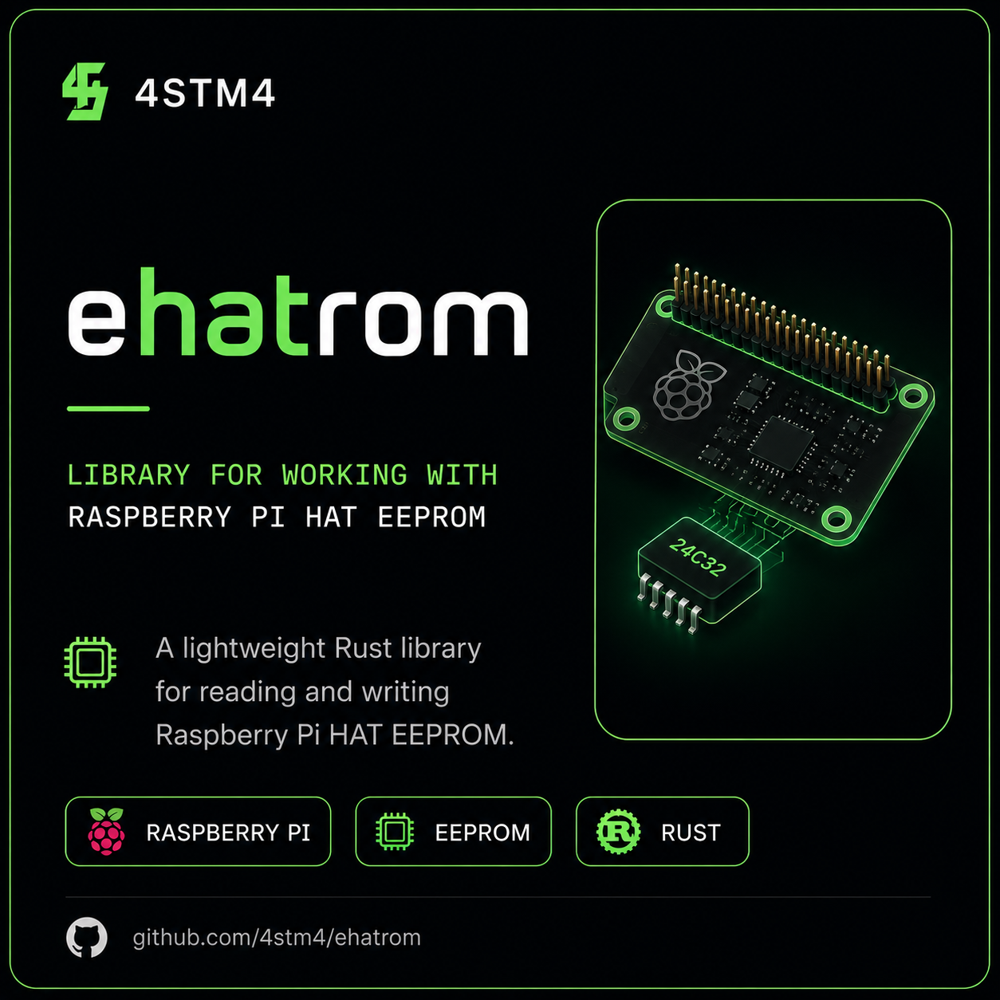

# 4STM4

**Tiny infrastructure tools, embedded Linux experiments, and Rust-first network software.**

I build small, understandable systems for networking, homelab, embedded Linux, and automation.

**Write safe. Write fast. Write Rust.**

Website: https://4stm4.website

---

## Featured Projects

<table>
  <tr>
    <td width="33%" align="center">
      
       
      <strong><a href="https://github.com/4stm4/nanodhcp">nanodhcp</a></strong>
    </td>
    <td width="33%" align="center">
      
       
      <strong><a href="https://github.com/4stm4/tinyWiFi">tinyWiFi</a></strong>
    </td>
    <td width="33%" align="center">
      
       
      <strong><a href="https://github.com/4stm4/nervum">Nervum</a></strong>
    </td>
  </tr>
  <tr>
    <td width="33%" align="center">
      
       
      <strong><a href="https://github.com/4stm4/testum">Testum</a></strong>
    </td>
    <td width="33%" align="center">
      
       
      <strong><a href="https://github.com/4stm4/pyjobkit">pyjobkit</a></strong>
    </td>
    <td width="33%" align="center">
      
       
      <strong><a href="https://github.com/4stm4/ehatrom">ehatrom</a></strong>
    </td>
  </tr>
</table>
