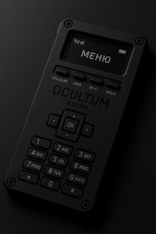

Ocultum 4STM4 – Tactical Communication Device

Overview
The Ocultum 4STM4 is a concept for a rugged handheld communication device, designed with a cyberpunk military aesthetic yet engineered for real-world practicality.
Our intention is to create a tool that merges multiple wireless standards into one compact, durable, and user-focused platform for enthusiasts, field engineers, and tactical operators.

Design Philosophy

Minimal snag points – all controls are recessed or low-profile.

Reliability first – tactile hardware switches, screw-fastened chassis.

Modular communication – cellular, LoRa, Wi-Fi, and traditional radio.

Cyberpunk military style – a device that feels at home in both the field and the future.

Specifications (Concept Stage)

Form Factor

Rugged die-cast aluminum chassis, matte black finish

Side-mounted recessed screws and rivets for durability

OLED high-contrast display (status icons + menu system)

Controls

4 recessed two-position slide switches for mode selection:

CELLULAR

LORA

WI-FI

RADIO

Central brand engraving: OCULTUM (primary) / 4STM4 (secondary)

5-way D-pad with a single centered OK button

3×4 numeric keypad for dialing, frequency input, and codes

Connectivity

Multi-band cellular support (4G/5G-ready, depending on module)

LoRa long-range low-power communication

Wi-Fi (2.4GHz / 5GHz)

VHF/UHF radio module with programmable frequencies

Power & Endurance

High-capacity removable Li-ion battery

USB-C fast charging + optional solar adapter

Low-power OLED for long battery life

Other Features (Planned)

Encrypted communication modes

Rugged IP67 water/dust resistance

Open firmware support for customization

Project Status

This repository documents the design and development journey of Ocultum 4STM4.
Currently in concept and prototyping phase — contributions, feedback, and ideas are welcome.
